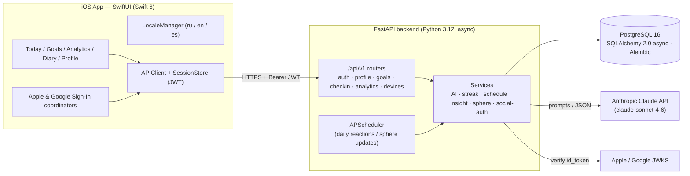
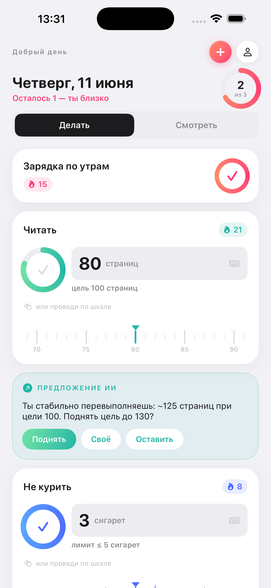
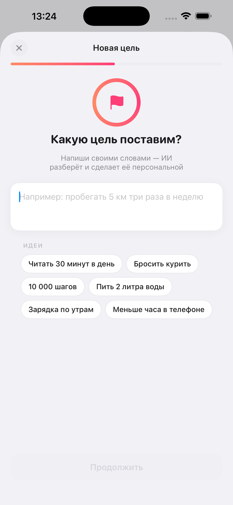
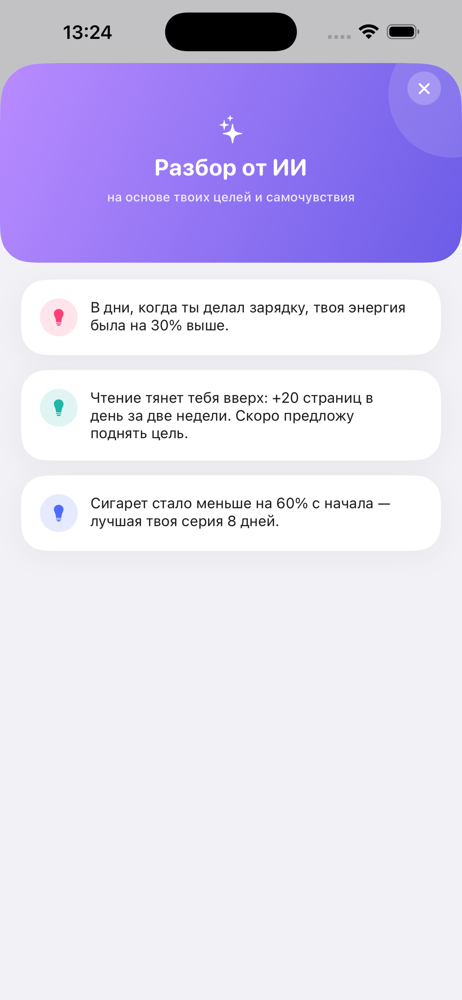
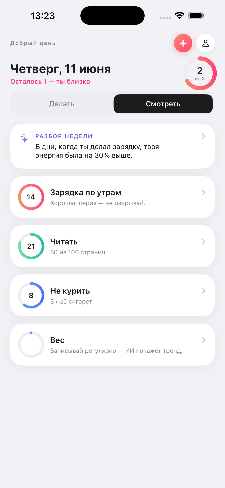

<p align="center">
  
</p>

# Klio

**An AI goal-tracking journal that shows you how your habits reshape your body and mind — one honest check-in at a time.**

<p>
  <a href="https://apps.apple.com/us/app/klio/id6771368116"></a>
  
  
  
  
  
  
  
  
  
</p>

---

> 📲 **Klio is live on the [App Store](https://apps.apple.com/us/app/klio/id6771368116)** — iPhone, iPad and Mac, in English, Russian and Spanish.

## Overview

**Klio** is a personal goal-tracking and diary application. You set a handful of everyday
goals — quit smoking, run, read, sleep more — and check in each day. Instead of a bare streak
counter, Klio uses **Anthropic Claude** to interview you when a goal is created, model the goal
as a structured object (horizon, measure, direction, cadence), and then translate your
consistency into a living picture of how your body and mind are actually changing.

Every day the app reacts to yesterday like an attentive coach, and a registry of **"development
spheres"** (Lungs, Heart, Stamina, Sharpness, Mood…) rises and falls in response to real
adherence — recovery is slow, relapses set you back, and inactivity quietly detrains you.

Everything the AI produces — questions, goal summaries, daily reactions, insights and sphere
captions — is generated in the user's own language (**Russian, English, Spanish**), and the
entire UI switches language at runtime.

## Features

- **AI-guided goal creation** — Claude parses a free-text goal into a taxonomy (eternal vs.
  situational, fact vs. quantitative, direction, baseline/target, cadence) and asks only the
  genuinely missing questions, one at a time.
- **Flexible scheduling & streaks** — daily / every-N-days / weekdays / times-per-week goals;
  streaks count only planned days, so a skipped off-day never breaks the chain.
- **Daily check-ins & universal logs** — mark goals done (binary) or record a value
  (quantitative), plus a single daily log of weight, sleep, energy and mood.
- **Health-impact analytics** — per-goal effect trajectories with milestone percentages,
  completion rates over 7/30/90 days, timelines for heatmaps, and weight/energy/mood trends.
- **Development spheres** — an AI-maintained 0–100 registry of body/mind/skill areas that each
  goal feeds into, moving realistically with adherence and relapse.
- **AI diary & daily reactions** — structured, multilingual coach cards (reaction / win / watch /
  tip / trend) plus weekly correlation insights ("on days you hit every goal, energy was 38% higher").
- **Multilingual AI (ru / en / es)** — one language directive drives every generated string;
  technical keys stay stable.
- **Full UI localization with runtime switch** — SwiftUI app re-renders instantly on language change.
- **Social + email auth** — Sign in with Apple and Google (server-side JWKS token verification)
  alongside classic email/password, all issuing app JWT access + refresh tokens.

## Architecture



The API is mobile-only: CORS is locked down, every mutating route is rate-limited via SlowAPI,
and social identity tokens are verified against the providers' rotating JWKS before an app JWT
is issued.

## Tech Stack

| Layer        | Technology |
|--------------|------------|
| Mobile       | Swift 6, SwiftUI, iOS 17+ (strict concurrency), XcodeGen |
| Auth (client)| Sign in with Apple, Google OAuth (PKCE), Keychain session |
| Backend      | Python 3.12, FastAPI, Uvicorn |
| Data         | PostgreSQL 16, SQLAlchemy 2.0 (async / asyncpg), Alembic |
| Validation   | Pydantic v2, pydantic-settings |
| Auth (server)| JWT (python-jose), passlib/bcrypt, JWKS verification for Apple/Google |
| AI           | Anthropic Claude (`claude-sonnet-4-6`) via the `anthropic` async SDK |
| Scheduling   | APScheduler |
| Hardening    | SlowAPI rate limiting, locked-down CORS |
| Ops          | Docker, Docker Compose, Caddy (reverse proxy / TLS) |

## Project Structure

```
klio/
├── backend/                      # FastAPI + PostgreSQL API
│   ├── app/
│   │   ├── main.py               # App factory, CORS, rate limiter, /health
│   │   ├── config.py             # Pydantic settings (env-driven)
│   │   ├── database.py           # Async engine / session
│   │   ├── api/
│   │   │   ├── deps.py           # Auth dependency (current user)
│   │   │   └── v1/               # auth · profile · goals · checkin · analytics · devices
│   │   ├── models/models.py      # SQLAlchemy models (users, goals, spheres, logs…)
│   │   ├── schemas/              # Pydantic request/response schemas
│   │   └── services/             # ai · streak · goal_schedule · insight · sphere ·
│   │                             #   social_auth · plan · adapt · scheduler
│   ├── migrations/               # Alembic (001_initial … 009_profile_language)
│   ├── docker/Dockerfile
│   ├── docker-compose.yml        # api + postgres (dev)
│   ├── pyproject.toml
│   └── .env.example
│
├── frontend/                     # iOS app (Swift / SwiftUI)
│   ├── Klio.xcodeproj
│   ├── project.yml               # XcodeGen spec
│   └── Sources/App/
│       ├── KlioApp.swift
│       ├── Core/                 # Network · Storage · Localization · Router · Design
│       ├── Features/             # Auth · Onboarding · Home · Dashboard · GoalCreation ·
│       │                         #   Analytics · Profile · Splash
│       └── Resources/            # ru/en/es .lproj localization
│
├── docs/                         # GOAL_DESIGN.md, screenshots/
├── SOCIAL_AUTH_SETUP.md          # Apple & Google sign-in configuration guide
├── LICENSE
└── README.md
```

## Getting Started

### Backend

```bash
cd backend

# 1. Configure environment
cp .env.example .env
#    then fill in: DATABASE_URL, SECRET_KEY, ANTHROPIC_API_KEY,
#    APPLE_CLIENT_ID, GOOGLE_CLIENT_ID

# 2a. Run everything with Docker (api + postgres)
docker compose up --build
#    API on http://localhost:8001  (Swagger at /docs)

# --- or run the API locally against your own Postgres ---

# 2b. Install and migrate
python -m venv .venv && source .venv/bin/activate
pip install -e ".[dev]"
alembic upgrade head
uvicorn app.main:app --reload
```

### iOS app

```bash
cd frontend
open Klio.xcodeproj          # then build & run the "Klio" scheme (iOS 17+)
# project.yml is the XcodeGen source of truth; run `xcodegen` to regenerate the project.
```

Point `AppConfig.apiBaseURL` at your backend, and configure Apple/Google client IDs as
described in [`SOCIAL_AUTH_SETUP.md`](SOCIAL_AUTH_SETUP.md).

## Screenshots

| Today | Create a goal | Analytics | Reflect (AI diary) |
|-------|---------------|-----------|--------------------|
|  |  |  |  |

## API Overview

Base path: `/api/v1` (all non-auth routes require a `Bearer` access token).

| Method & Path | Purpose |
|---------------|---------|
| `POST /auth/register` · `POST /auth/login` · `POST /auth/refresh` | Email/password auth, JWT access + refresh |
| `POST /auth/apple` · `POST /auth/google` | Verify provider `id_token` (JWKS) and issue app JWTs |
| `GET /profile` · `PUT /profile` · `DELETE /profile/me` | Read/update profile, delete account |
| `POST /goals/start` → `POST /goals/{id}/answer` → `POST /goals/{id}/confirm` | AI goal-creation dialog |
| `GET /goals` · `GET /goals/{id}` · `POST /goals/{id}/adapt` · `GET /goals/{id}/history` · `DELETE /goals/{id}` | Goal CRUD, adaptation, history |
| `GET /checkin/today` · `GET /checkin/{date}` · `POST /checkin` | Today's planned goals and daily check-in + log |
| `GET /analytics/goals/{id}/streak` · `.../effects` · `.../timeline` | Streaks, effect progress, heatmap timeline |
| `GET /analytics/daily-log/timeline` · `GET /analytics/spheres` | Weight/energy/mood trends, development spheres |
| `GET /analytics/insights` · `GET /analytics/insights/status` · `POST /analytics/insights/refresh` | AI insights (cached / on-demand) |
| `POST /devices/token` | Register APNs device token |
| `GET /health` | Liveness probe |

Interactive OpenAPI docs are served at `/docs` when the backend is running.

## Status / Roadmap

The core product is implemented end to end: async FastAPI backend with 9 Alembic migrations,
email + Apple + Google auth, AI-driven goal creation, flexible scheduling and streaks, daily
check-ins, health-impact analytics, development spheres, multilingual AI diary/insights, and a
Swift 6 SwiftUI client with runtime localization.

Roadmap items still open (see [`backend/ROADMAP.md`](backend/ROADMAP.md)):

- Push notifications over APNs (device tokens are already captured) — check-in reminders and
  milestone/hint pushes.
- Broader automated test coverage (unit for streak/schedule/insight services, integration for
  every endpoint) and CI/CD via GitHub Actions.

## License

MIT — see [LICENSE](LICENSE). Copyright (c) 2026 Egor Fomenko.
